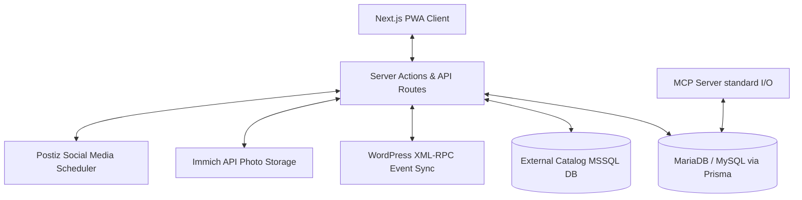

# Project Overview

Co+promote is a comprehensive promotion management system designed to streamline the organization of
projects, tasks, contacts, and events. By integrating robust project and Kanban-style task boards
with professional CRM contacts, unified calendar systems, external product catalogs, and automated
social media publishing/email newsletter platforms, Co+promote serves as a central hub for marketing
workflows. The application also features an internal canvas-based image editor, native Immich
photo gallery integration, and a standard I/O Model Context Protocol (MCP) server for deep, native AI-driven
automation.

## Repository Structure

- [.Jules](file:///home/jehb/projects/promoty/.jules) - Contains storage, cache, and history tracking for the Jules AI assistant.
- [.agent](file:///home/jehb/projects/promoty/.agent) - Holds markdown definitions for automated developer workflows (build, test, deploy, seed, migrate).
- [.antigravity](file:///home/jehb/projects/promoty/.antigravity) - State mappings, preferences, and cache for the Antigravity agent.
- [.antigravitycli](file:///home/jehb/projects/promoty/.antigravitycli) - Operational context and execution state metadata for the Antigravity agent CLI.
- [.github](file:///home/jehb/projects/promoty/.github) - Contains GitHub Actions CI/CD workflows, specifically Docker image builders.
- [__tests__](file:///home/jehb/projects/promoty/__tests__) - Holds unit, component, logic layout, mock, and integration test suites.
- [app](file:///home/jehb/projects/promoty/app) - The Next.js 16 App Router hierarchy containing pages, API routes, and Server Actions.
- [components](file:///home/jehb/projects/promoty/components) - Reusable UI widgets and layout modules matching the application's page categories.
- [data](file:///home/jehb/projects/promoty/data) - Stores localized SQLite database files and development error logs.
- [docs](file:///home/jehb/projects/promoty/docs) - Contains architecture overviews, database schemas, page routes, guidelines, and packaging specifications.
- [hooks](file:///home/jehb/projects/promoty/hooks) - Implements reusable client-side React hooks for debouncing and offline action synchronization.
- [lib](file:///home/jehb/projects/promoty/lib) - Holds database clients (Prisma, MSSQL), helper functions, session parsing, and authentication APIs.
- [mcp](file:///home/jehb/projects/promoty/mcp) - Houses the source code and configuration for the Node.js Model Context Protocol (MCP) standard I/O server.
- [prisma](file:///home/jehb/projects/promoty/prisma) - Contains the Prisma schema definitions, SQL migration files, and database seed scripts.
- [public](file:///home/jehb/projects/promoty/public) - Holds static visual assets, webapp manifest configurations, and user-facing help documentation.
- [scripts](file:///home/jehb/projects/promoty/scripts) - Automated tasks for syncing third-party data and populating database states.
- [types](file:///home/jehb/projects/promoty/types) - Global TypeScript declarations and helper interface definitions.

## Build & Development Commands

Preserve the following commands exactly when setting up or running the project:

### Dependencies & Setup
```bash
# Install dependencies
npm install

# Generate Prisma Client
npx prisma generate
```

### Development
```bash
# Start Docker MariaDB container
docker compose up -d mariadb

# Run Next.js development server
npm run dev
```

### Database Operations
```bash
# Run database migrations in development
npx prisma migrate dev

# Seed database with initial records
npx prisma db seed
```

### Build & Start (Production Simulation)
```bash
# Start Docker MariaDB container
docker compose up -d mariadb

# Build Next.js application
npm run build

# Start production server
npm start
```

### Testing & Verification
```bash
# Run the complete Jest test suite
npm test

# Run tests in watch mode
npm run test:watch

# Run tests with coverage reports
npm run test:coverage

# Run ESLint validation
npm run lint
```

### MCP Server Integration
```bash
# Compile the MCP server code
cd mcp
npm run build

# Start the MCP server using Standard I/O
npm run start
```

### Container Deployment
```bash
# Build Docker images
docker compose build

# Recreate and run all containers in background
docker compose up -d
```

## Code Style & Conventions

### Language & Formatting
- **TypeScript**: Strictly enforced configuration (configured in [tsconfig.json](file:///home/jehb/projects/promoty/tsconfig.json)).
- **Linter**: ESLint is configured to extend Next.js vitals rules (see [eslint.config.mjs](file:///home/jehb/projects/promoty/eslint.config.mjs)).
- > TODO: Define an explicit code formatter configuration file (e.g. Prettier configuration) in the project root.

### Naming Patterns
- **React Components**: PascalCase for files and exports (e.g., `SocialFilterBar.tsx`).
- **Hooks & Contexts**: camelCase beginning with `use` (e.g., `useOfflineMutation.ts`).
- **Prisma Schema**: PascalCase singular names for models; relation bridge tables mapped explicitly.
- **API Endpoints**: Kept lowercase with kebab-case dynamic route directories.

### Commit Messages
- Use the standard deploy workflow format: `git commit -m "[Meaningful commit message describing the changes]"`
- > TODO: Standardize on a Conventional Commits format (e.g., `feat:`, `fix:`, `refactor:`) in project documentation.

## Architecture Notes

Co+promote follows a Next.js App Router full-stack architecture with decoupled integration points.



### Core Architecture Components
1. **Next.js App Router (React 19)**: Orchestrates server components, API routing, custom styling (Tailwind CSS), and client states with React Query.
2. **Local Database (MariaDB/MySQL)**: Serves as the primary operational store (Contacts, Projects, Events, Tasks, Users) accessed via Prisma.
3. **External Database (MSSQL)**: A read-only catalog repository storing product specifications synced by UPC.
4. **Media Storage (Immich)**: External platform managing cloud asset storage, gallery retrieval, and tagging.
5. **Publishing (Postiz)**: Social media gateway for scheduling and dispatching drafted posts.
6. **AI Assistant & MCP**: Standard standard-I/O server enabling language models to inspect and modify contacts, tasks, calendar entries, and posts.

## Testing Strategy

Co+promote implements Jest and React Testing Library to validate application behavior.

### Execution
- **Local Suite**: Run `npm test` after launching the MariaDB container (`docker compose up -d mariadb`).
- **CI/CD Configuration**: Ensure tests run in CI/CD using:
  ```yaml
  - name: Run tests
    run: npm test -- --ci --coverage
  ```

### Scope
1. **Unit Tests** (`__tests__/unit/`): Target utility files (e.g., [utils.ts](file:///home/jehb/projects/promoty/lib/utils.ts)) and state registries.
2. **Component Tests** (`__tests__/components/`): Validate interactive layouts like Sidebar collapsible states, online/offline indicators, and filtration bars.
3. **Mocks** (defined in [jest.setup.ts](file:///home/jehb/projects/promoty/jest.setup.ts)): Isolate testing files from active database connections, IndexedDB APIs, routing hooks (`next/navigation`), and UUID generations.

## Security & Compliance

### Secrets Management
- Application configurations must be placed in a local `.env` file (not tracked in Git).
- Secrets include database connection strings (`DATABASE_URL`), JWT encryption credentials (`JWT_SECRET_KEY`), WordPress sync profiles (`WORDPRESS_APP_PASSWORD`), and API keys (`IMMICH_API_KEY`).

### Security Configurations
- **HTTP Headers**: Enforced via [next.config.ts](file:///home/jehb/projects/promoty/next.config.ts) to protect client interactions:
  - `X-Content-Type-Options: nosniff`
  - `X-Frame-Options: SAMEORIGIN`
  - `X-XSS-Protection: 1; mode=block`
  - `Strict-Transport-Security: max-age=31536000; includeSubDomains; preload`
  - `Referrer-Policy: strict-origin-when-cross-origin`
- **Session Authentication**: Secured via NextAuth with cookie configurations that block non-SSL storage in production environments.
- > TODO: Define automated dependency-scanning (e.g. Snyk or Dependabot) in the repository's CI workflow.
- **License**: The repository is licensed under the GNU Affero General Public License v3.0, defined in [LICENSE](file:///home/jehb/projects/promoty/LICENSE).

## Agent Guardrails

Automated agents must strictly adhere to the following rules:

### Boundaries & Files Never to Touch
- **Staging/Production SQLite Databases**: Never manually write to or modify [prod.db](file:///home/jehb/projects/promoty/data/prod.db).
- **Environment Contexts**: Do not modify or alter the secrets in `.env` without direct instruction.
- **Workflow Definitions**: Do not edit `.agent/workflows/*` configurations unless explicitly asked.

### Debugging & Cleanup Rules (from docs/AI_RULES.md)
1. **Logs & Debugging**: Always redirect command executions to temporary files (e.g., file names matching `*.log` or stored in untracked folders) to prevent polluting terminal histories.
2. **State Cleanliness**: All temporary log files must be deleted, documentation files must be updated, and tests must run cleanly before initiating any git commit.
3. **Git Practices**: Assume `git commit` should follow successful `git push` actions.
4. **Deploy Lifecycle**: Rebuild and restart docker compose container services (`docker compose up -d`) following code changes.
5. **Documentation Maintenance**:
   - Update markdown files under [public/docs/help/](file:///home/jehb/projects/promoty/public/docs/help) when making feature changes (e.g. `contacts.md`, `events.md`, `social.md`).
   - Sync development roadmap updates to [PLAN.md](file:///home/jehb/projects/promoty/PLAN.md) or related implementation plans.
   - Refactor corresponding JSDoc comments to stay in line with function updates.

## Extensibility Hooks

- **Environment Flags**:
  - `DISABLE_SECURE_COOKIES=true` skips HTTPS validation requirements during container or local HTTP executions.
  - `EXTERNAL_DB_TYPE` determines drivers used for catalog validations.
- **WordPress Event Feeds**: Sync is driven by [scripts/import_wp_events_2026.ts](file:///home/jehb/projects/promoty/scripts/import_wp_events_2026.ts), matching fields configuration dynamically.
- **Role Permissions**: Dynamic overrides are defined inside [app/admin/permissions/page.tsx](file:///home/jehb/projects/promoty/app/admin/permissions/page.tsx) and can be extended to support custom roles.

## Further Reading

- [Database Model Schema](file:///home/jehb/projects/promoty/docs/models.md) - Detail on schema relationships and database structures.
- [Application Pages & Routes](file:///home/jehb/projects/promoty/docs/pages.md) - Layout and structural breakdown of app views.
- [AI Agent Rules](file:///home/jehb/projects/promoty/docs/AI_RULES.md) - Guidelines for codebase assistants.
- [Android Packaging Instructions](file:///home/jehb/projects/promoty/docs/android-packaging-guide.md) - Directives on build packaging.
- [Testing Guide and Setup](file:///home/jehb/projects/promoty/__tests__/README.md) - Strategy outline for writing and running test blocks.
